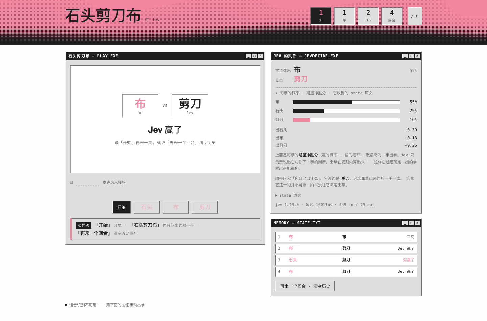

# 石头剪刀布 · 对 Jev



> 截图是一局结算。右边那栏默认收着，这里展开来看：Jev 读出「这人爱出布」（55%），
> 于是出剪刀赢了这一局。

和 [Jev](https://typesafe.ai)（TypeSafe 的 System One 决策模型）猜拳。

这同时是**对 Jev 预训练模型「简单推理」能力的一次实测**。不微调、不给工具、不给多轮
对话让人打草稿：每个回合它只拿到一段 `state`（规则 + 前几手的出拳和输赢），要在这点
信息里读出对手的习惯 —— 连着出同一手？在循环？什么时候会变？—— 并写成一个概率分布。

它也没有作弊的余地：出拳这一问在你开口**之前**就发出去了，它能看到的历史里没有这一回合。

## 快速开始

```bash
export JEV_API_KEY="..."      # 或 TYPESAFE_API_KEY
python3 src/server.py         # 然后打开 http://127.0.0.1:8765
```

只有标准库，不需要 `pip install`。先确认密钥能用：

```bash
python3 src/server.py --check
```

## 怎么玩

| 你说 | 会发生什么 |
| --- | --- |
| 「开始」 | 屏幕上走 3 → 2 → 1，同时 Jev 开始判断 |
| 「石头剪刀布」，然后喊「石头」/「剪刀」/「布」 | 你这一手被录进去 |
| 「再来一个回合」 | 清空历史，直接进下一回合 |

倒计时每一拍都有音效，数字和那一声是同一刻到的。开牌时赢、输、平局各有动画和音效。
你一停下来录音就停了，不用按任何东西；麦克风没接通也能玩，倒计时期间和之后都能点按钮出拳。

**历史就是 Jev 的记忆**：每打完一局，双方的出拳和输赢都会追加到右下角那个列表里，
下一局开始时整段历史被写进它的 `state`。「再来一个回合」清空。

## 目录

| 路径 | 内容 |
| --- | --- |
| `src/game.py` | 纯逻辑：规则、`state` 原文、从信念到出拳的算术、语音文本解析 |
| `src/server.py` | 本地服务器：代理 Jev（密钥不出服务器）、识别转发、静态页面、缓存 |
| `web/index.html` | 页面，单文件零外部依赖：倒计时与音效、牌桌、记忆、语音接线 |
| `tests/` | `game.py` 56 个 + `server.py` 23 个测试，不联网 |
| `docs/` | 下面那几篇 |
| `var/` | 运行时产物（识别的本地缓存），已 gitignore |

## 测试

```bash
python3 tests/test_game.py && python3 tests/test_server.py
```

## 文档

| 文档 | 讲什么 |
| --- | --- |
| [`docs/architecture.md`](docs/architecture.md) | 三块怎么分工、一次出拳的数据流、密钥边界 |
| [`docs/jev.md`](docs/jev.md) | 为什么只让 Jev 给信念分布、`state` 怎么写、缓存、上游的脾气 |
| [`docs/speech.md`](docs/speech.md) | 两条识别路径、听到停顿就停、按读音而不是按字认出出拳 |
| [`docs/design.md`](docs/design.md) | typesafe.ai 视觉语言、倒计时与音效对齐、结算动画 |

## 说明

- 密钥只在服务器进程里，页面拿不到。
- 历史只存在浏览器内存里，刷新页面就没了 —— 没有做持久化。
